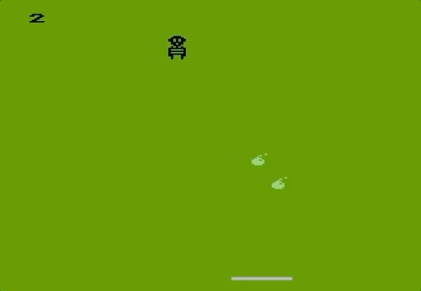

# 2019-Bomber
Kaboom! game in Turbo BASIC XL for Atari 8-bit. Entry for 2019 10-line BASIC contest

My sixth entry in the 2019 10-line BASIC contest is Bomber, a Kaboom! clone. It’s written in Turbo BASIC XL and fits in the PUR-120 category. You need a paddle controller and quick reflexes to catch the mad bomber’s falling bombs. The game ends when you miss five bombs. You earn one point for catching a bomb, and lose an increasing number of points for missing them.
